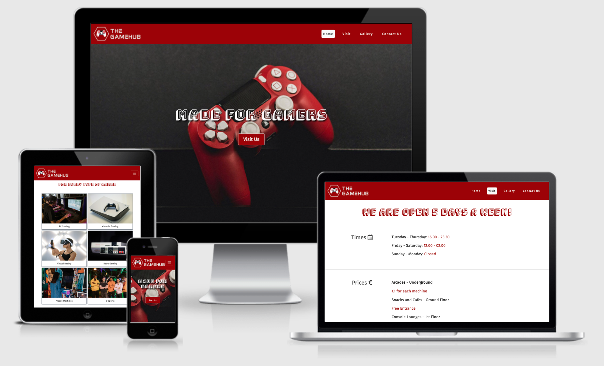
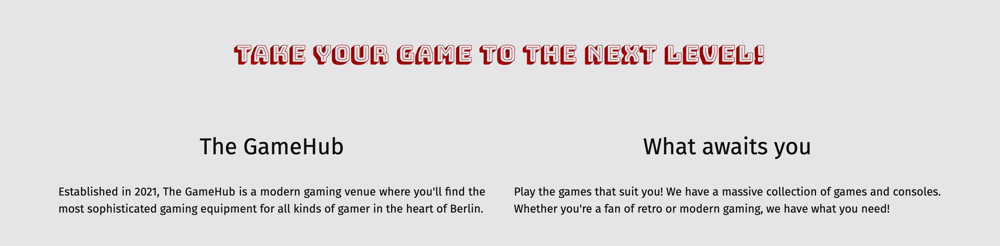
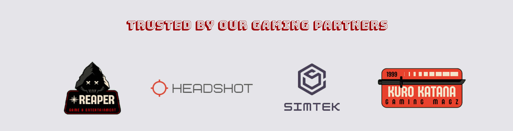
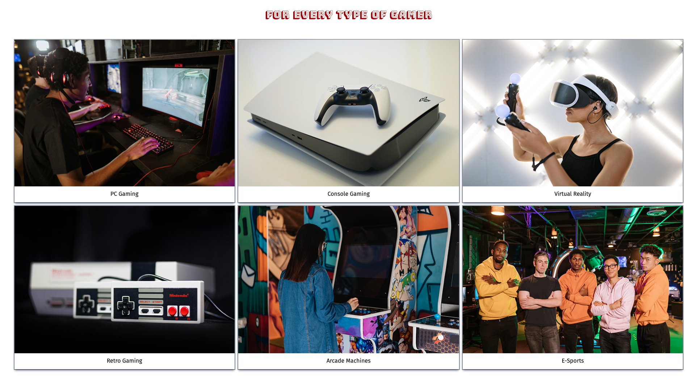
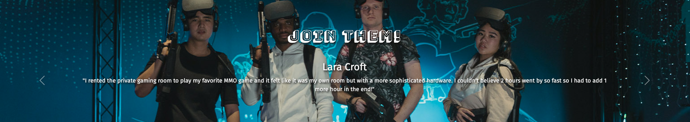
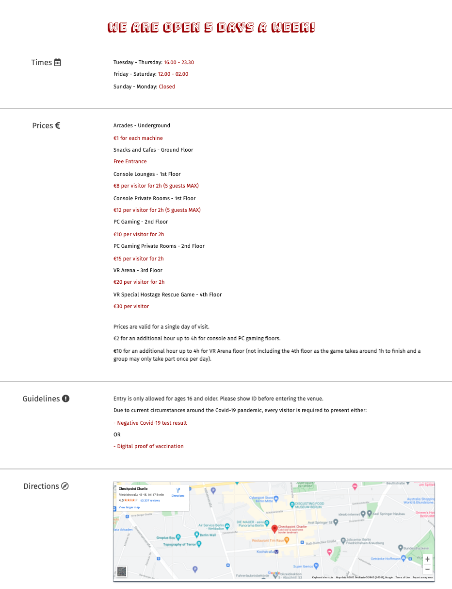

# The GameHub

Welcome to GameHub!

The GameHub is a gaming venue website, with which the owners intend to attract members of the gaming community and them to come visit a brand new this brand new gaming venue located in central Berlin and try their hands on the latest gaming apparatus available on site. Gamers can come alone or bring up to four friends to the site to enjoy some fun time together.

The website showcases the available types of gaming activities on both the homepage and gallery page. It also informs interested visitors of the business' opening times, prices, guidelines during the pandemic, and directions. On the contact page, one can also use the contact form to contact GameHub, whether it be for general inquiries or reservation purposes.

[Live Website HERE](https://lapratomo24.github.io/the-gamehub/)



## User Experience (UX)

### User Stories

- #### New users are able to:
    - Learn about the gaming venue, its offerings, its business hours, and its location.
    - Navigate through the pages easily and find all relevant information.
    - Be able to use the contact form for any inquiry regarding the venue.
    - Have a positive experience using the website.

- #### Returning users are able to:
    - Remind themselves of its business hours.
    - Get in contact with GameHub for any inquiry.
    - Find social media buttons to follow and see any updates from the venue.

### Design

- #### Color Scheme
    - Only two main colors are used, namely red #990000 and white #fafafa.

- #### Typography
    - The main font for headlines or headings is Bungee Shade with cursive as the fallback font in case the user's browser does not support the main font. The font used for most of the content is Fira Sans with sans-serif as the fallback font.

- #### Imagery
    - The image used for the hero image is of a game controller, which should give a good idea of what the site might be about for users who visit it for the first time. Other images used throughout the website represent the imaginary business well, with gaming apparatus and activities that can raise users' interest to come and visit the GameHub venue.

## Structure

The website consists of four pages beginning with the default homepage. On all four pages, users can see the top navigation bar with the business logo on the left, which functions the same way as the first navigation item to the right of it, Home, which is to take the users back to the homepage after visiting one of the other three pages. The homepage displays the hero image and headline text, the about section right after it, as well as a small gallery and visitor testimony just below it. The footer, which is displayed on all four pages, consists of copyright text on the left and social media icons on the right. The icons are external links which, when clicked, will open a new tab and redirect users to each social media channel represented by their respective icons.

The website is easily navigable and fully responsive across all screen sizes.

## Features

- #### Navigation Bar

   - The website begins with a visible header which is, as per norm, is filled with a business logo and top navigation items. The GameHub logo is created on Canva and colored white so it contrasts well with red as the background. Fully responsive top navigations bar consists of 4 items, namely Home, Visit, Gallery, and Contact Us. Each item reacts when one hovers over it or when the page represented by each button is active after clicking. This header is identical on all four pages of the website, and it will allow users to navigate through the pages easily across devices without having to click the 'back' button. This navigation bar as a whole also stays visible whenever users scroll down the pages.

   - Through the use of bootstrap, the navigation bar is designed to be responsive when users are on devices with different, smaller screen sizes such as tablets and smartphones. The navigation items will collapse into a toggler, which sometimes is called a burger button, on smaller screen sizes. The four navigation items should be visible in a vertical order when users click on the toggler, which then can be used to navigate the site in the same way as when viewing from a PC or laptop.

   

- #### Hero Image

    The hero image, coupled with an eye-catching headline text, introduces first-time visitors to GameHub. It conveys the message of what the website is about. It shows a gaming controller with text overlay 'made for gamers' to grab users' attention. Just below the headline text, users can see a responsive 'Visit Us' button which, when clicked, will redirect users to the business hours of GameHub. The hero image is set as fixed, meaning that when users scroll down the page, the image stays fixed to the top to give a prettier transition feel to it.

    

- #### About Section

    - The about section consists of two small sections. One is a brief description of The GameHub and the purpose of the establishment preceded by a call-to-action headline text in red. Section two's purpose is to show that the business is partnered with well-known, imaginary establishments in the gaming community. This in turn will give a sense of trust to those who are interested to come and visit The GameHub.

    - Both the about section and partners section are fully responsive. The text below the headline will stack on top of each other on smaller screen sizes. Likewise, the four partner logos will also behave in a similar way.

    <details><summary><b>About - Description</b></summary>

    
    </details><br />

    <details><summary><b>About - Partners</b></summary>

    
    </details><br />

- #### Small Gallery Section

    The small gallery section on the homepage showcases six images of different types of gaming visitors can enjoy spending time on within GameHub, each accompanied by a short text to describe said activities. On smaller screen sizes between 600 to 950px wide, the three-columned images will turn to two-columned images for responsive purposes. On even smaller screen sizes, the images will stack on top of each other and have a full-sized width based on viewport.

    <details><summary><b>Small Gallery</b></summary>

    
    </details><br />

- #### Testimony Section

    The tesimony section is another way to convince first-time visitors that others have been to The GameHub and had a good experience spending time on playing games at the establishment. The carousel is added via a bootstrap library, and showcases a testimony from two different imaginary people each. It has a background of four virtual reality gamers as a nice and colorful backdrop behind the texts. This section is also responsive based on different screen sizes.

    <details><summary><b>Testimony</b></summary>

    
    </details><br />

- #### Footer

    The footer is located at the bottom of the page with the same red background as the top navigation bar. On the left side is a simple copyright text, notifying users that the site belongs to GameHub. And on the right side are the externally-linked social media buttons, which when clicked, open a new tab to redirect users to each social media channel. The footer is fully responsive, and on smaller screen sizes it will retain the social media buttons and make the left-side text disappear, positioning the former to the center of the screen.

    

- #### Visit Page

    - The first separate page to be introduced is the visit page. This page can be navigated to using either the visit button on the navigation bar or the call-to-action visit us button in front of the hero image on the homepage. This page essentially informs would-be visitors of GameHub's business hours, or in other words the days and times when visitors are able to visit the establishment. Next, visitors can see the prices set for different kinds of entertainment within GameHub. And due to the pandemic, there are also guidelines to follow when visiting GameHub. And just below it, the map shows the exact location of the gaming venue, which in this example is located in Checkpoint Charlie in Berlin, Germany.

    - The page is fully responsive. The texts and the map will shift to the center when viewed on smaller screen sizes.

    

- #### Gallery Page

    - The gallery page 

    

### 


A blue button should appear to click: _Make Public_,

Another blue button should appear to click: _Open Browser_.

To run a backend Python file, type `python3 app.py`, if your Python file is named `app.py` of course.

A blue button should appear to click: _Make Public_,

Another blue button should appear to click: _Open Browser_.

In Gitpod you have superuser security privileges by default. Therefore you do not need to use the `sudo` (superuser do) command in the bash terminal in any of the lessons.

To log into the Heroku toolbelt CLI:

1. Log in to your Heroku account and go to *Account Settings* in the menu under your avatar.
2. Scroll down to the *API Key* and click *Reveal*
3. Copy the key
4. In Gitpod, from the terminal, run `heroku_config`
5. Paste in your API key when asked

You can now use the `heroku` CLI program - try running `heroku apps` to confirm it works. This API key is unique and private to you so do not share it. If you accidentally make it public then you can create a new one with _Regenerate API Key_.

------

## Release History

We continually tweak and adjust this template to help give you the best experience. Here is the version history:

**September 1 2021:** Remove `PGHOSTADDR` environment variable.

**July 19 2021:** Remove `font_fix` script now that the terminal font issue is fixed.

**July 2 2021:** Remove extensions that are not available in Open VSX.

**June 30 2021:** Combined the P4 and P5 templates into one file, added the uptime script. See the FAQ at the end of this file.

**June 10 2021:** Added: `font_fix` script and alias to fix the Terminal font issue

**May 10 2021:** Added `heroku_config` script to allow Heroku API key to be stored as an environment variable.

**April 7 2021:** Upgraded the template for VS Code instead of Theia.

**October 21 2020:** Versions of the HTMLHint, Prettier, Bootstrap4 CDN and Auto Close extensions updated. The Python extension needs to stay the same version for now.

**October 08 2020:** Additional large Gitpod files (`core.mongo*` and `core.python*`) are now hidden in the Explorer, and have been added to the `.gitignore` by default.

**September 22 2020:** Gitpod occasionally creates large `core.Microsoft` files. These are now hidden in the Explorer. A `.gitignore` file has been created to make sure these files will not be committed, along with other common files.

**April 16 2020:** The template now automatically installs MySQL instead of relying on the Gitpod MySQL image. The message about a Python linter not being installed has been dealt with, and the set-up files are now hidden in the Gitpod file explorer.

**April 13 2020:** Added the _Prettier_ code beautifier extension instead of the code formatter built-in to Gitpod.

**February 2020:** The initialisation files now _do not_ auto-delete. They will remain in your project. You can safely ignore them. They just make sure that your workspace is configured correctly each time you open it. It will also prevent the Gitpod configuration popup from appearing.

**December 2019:** Added Eventyret's Bootstrap 4 extension. Type `!bscdn` in a HTML file to add the Bootstrap boilerplate. Check out the <a href="https://github.com/Eventyret/vscode-bcdn" target="_blank">README.md file at the official repo</a> for more options.

------

## FAQ about the uptime script

**Why have you added this script?**

It will help us to calculate how many running workspaces there are at any one time, which greatly helps us with cost and capacity planning. It will help us decide on the future direction of our cloud-based IDE strategy.

**How will this affect me?**

For everyday usage of Gitpod, it doesn’t have any effect at all. The script only captures the following data:

- An ID that is randomly generated each time the workspace is started.
- The current date and time
- The workspace status of “started” or “running”, which is sent every 5 minutes.

It is not possible for us or anyone else to trace the random ID back to an individual, and no personal data is being captured. It will not slow down the workspace or affect your work.

**So….?**

We want to tell you this so that we are being completely transparent about the data we collect and what we do with it.

**Can I opt out?**

Yes, you can. Since no personally identifiable information is being captured, we'd appreciate it if you let the script run; however if you are unhappy with the idea, simply run the following commands from the terminal window after creating the workspace, and this will remove the uptime script:

```
pkill uptime.sh
rm .vscode/uptime.sh
```

**Anything more?**

Yes! We'd strongly encourage you to look at the source code of the `uptime.sh` file so that you know what it's doing. As future software developers, it will be great practice to see how these shell scripts work.

---

Happy coding!
