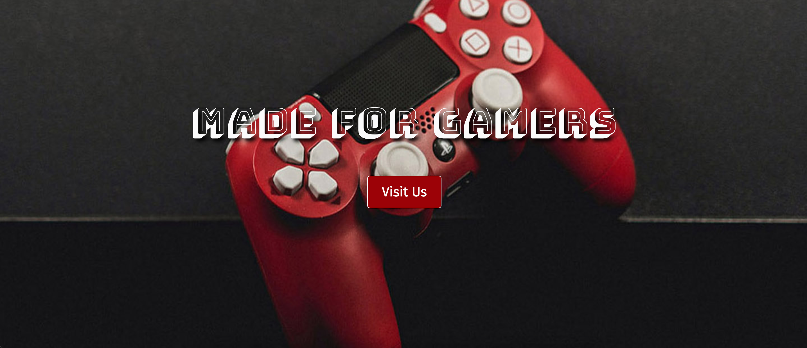
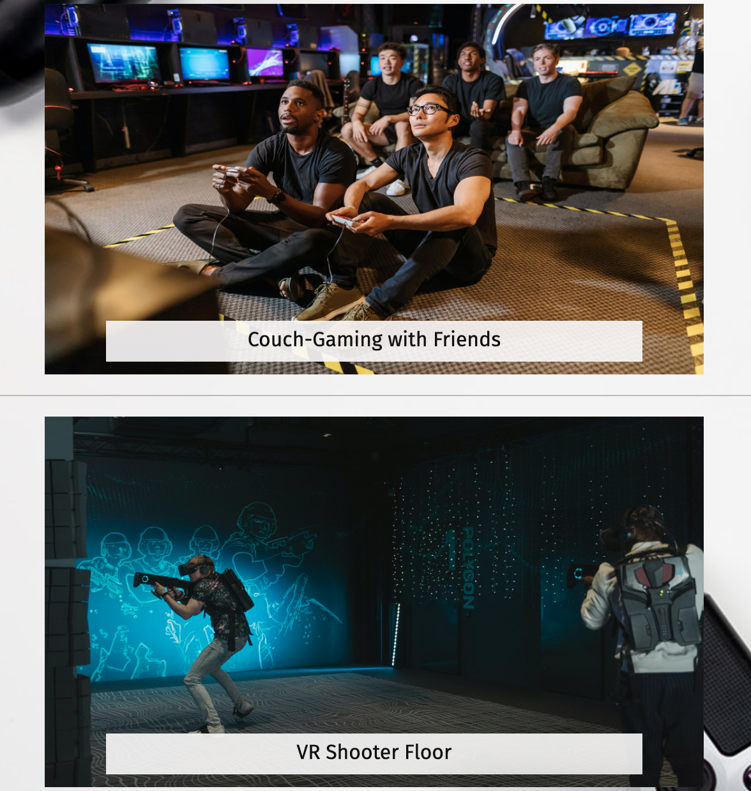

# The GameHub

Welcome to GameHub!

The GameHub is a gaming venue website, with which the owners intend to attract members of the gaming community and them to come visit a brand new this brand new gaming venue located in central Berlin and try their hands on the latest gaming apparatus available on site. Gamers can come alone or bring up to four friends to the site to enjoy some fun time together.

The website showcases the available types of gaming activities on both the homepage and gallery page. It also informs interested visitors of the business' opening times, prices, guidelines during the pandemic, and directions. On the contact page, one can also use the contact form to contact GameHub, whether it be for general inquiries or reservation purposes.

[Live Website HERE](https://lapratomo24.github.io/the-gamehub/)

## User Experience (UX)

### User Stories

- #### New users are able to:
    - Learn about the gaming venue, its offerings, its business hours, and its location.
    - Navigate through the pages easily and find all relevant information.
    - Be able to use the contact form for any inquiry regarding the venue.
    - Have a positive experience using the website.

- #### Returning users are able to:
    - Remind themselves of its business hours.
    - Get in contact with GameHub for any inquiry.
    - Find social media buttons to follow and see any updates from the venue.

### Design

- #### Color Scheme
    - Only two main colors are used, namely red #990000 and white #fafafa.

- #### Typography
    - The main font for headlines or headings is Bungee Shade with cursive as the fallback font in case the user's browser does not support the main font. The font used for most of the content is Fira Sans with sans-serif as the fallback font.

- #### Imagery
    - The image used for the hero image is of a game controller, which should give a good idea of what the site might be about for users who visit it for the first time. Other images used throughout the website represent the imaginary business well, with gaming apparatus and activities that can raise users' interest to come and visit the GameHub venue.

## Structure

The website consists of four pages beginning with the default homepage. On all four pages, users can see the top navigation bar with the business logo on the left, which functions the same way as the first navigation item to the right of it, Home, which is to take the users back to the homepage after visiting one of the other three pages. The homepage displays the hero image and headline text, the about section right after it, as well as a small gallery and visitor testimony just below it. The footer, which is displayed on all four pages, consists of copyright text on the left and social media icons on the right. The icons are external links which, when clicked, will open a new tab and redirect users to each social media channel represented by their respective icons.

The website is easily navigable and fully responsive across all screen sizes.

## Features

### Navigation Bar

   - The website begins with a visible header which is, as per norm, is filled with a business logo and top navigation items. The GameHub logo is created on Canva and colored white so it contrasts well with red as the background. Fully responsive top navigations bar consists of 4 items, namely Home, Visit, Gallery, and Contact Us. Each item reacts when one hovers over it or when the page represented by each button is active after clicking. This header is identical on all four pages of the website, and it will allow users to navigate through the pages easily across devices without having to click the 'back' button. This navigation bar as a whole also stays visible whenever users scroll down the pages.

   - Through the use of bootstrap, the navigation bar is designed to be responsive when users are on devices with different, smaller screen sizes such as tablets and smartphones. The navigation items will collapse into a toggler, which sometimes is called a burger button, on smaller screen sizes. The four navigation items should be visible in a vertical order when users click on the toggler, which then can be used to navigate the site in the same way as when viewing from a PC or laptop.

   

### Hero Image

The hero image, coupled with an eye-catching headline text, introduces first-time visitors to GameHub. It conveys the message of what the website is about. It shows a gaming controller with text overlay 'made for gamers' to grab users' attention. Just below the headline text, users can see a responsive 'Visit Us' button which, when clicked, will redirect users to the business hours of GameHub. The hero image is set as fixed, meaning that when users scroll down the page, the image stays fixed to the top to give a prettier transition feel to it.

### About Section

- The about section consists of two small sections. One is a brief description of The GameHub and the purpose of the establishment preceded by a call-to-action headline text in red. Section two's purpose is to show that the business is partnered with well-known, imaginary establishments in the gaming community. This in turn will give a sense of trust to those who are interested to come and visit The GameHub.

- Both the about section and partners section are fully responsive. The text below the headline will stack on top of each other on smaller screen sizes. Likewise, the four partner logos will also behave in a similar way.

<b>About - Description</b>

 

<b>About - Partners</b>

 

### Small Gallery Section

The small gallery section on the homepage showcases six images of different types of gaming visitors can enjoy spending time on within GameHub, each accompanied by a short text to describe said activities. On smaller screen sizes between 600 to 950px wide, the three-columned images will turn to two-columned images for responsive purposes. On even smaller screen sizes, the images will stack on top of each other and have a full-sized width based on viewport.

<b>Small Gallery</b>

 

### Testimony Section

The tesimony section is another way to convince first-time visitors that others have been to The GameHub and had a good experience spending time on playing games at the establishment. The carousel is added via a bootstrap library, and showcases a testimony from two different imaginary people each. It has a background of four virtual reality gamers as a nice and colorful backdrop behind the texts. This section is also responsive based on different screen sizes.

<b>Testimony</b>

 

### Footer

The footer is located at the bottom of the page with the same red background as the top navigation bar. On the left side is a simple copyright text, notifying users that the site belongs to GameHub. And on the right side are the externally-linked social media buttons, which when clicked, open a new tab to redirect users to each social media channel. The footer is fully responsive, and on smaller screen sizes it will retain the social media buttons and make the left-side text disappear, positioning the former to the center of the screen.

### Visit Page

- The first separate page to be introduced is the visit page. This page can be navigated to using either the visit button on the navigation bar or the call-to-action visit us button in front of the hero image on the homepage. This page essentially informs would-be visitors of GameHub's business hours, or in other words the days and times when visitors are able to visit the establishment. Next, visitors can see the prices set for different kinds of entertainment within GameHub. And due to the pandemic, there are also guidelines to follow when visiting GameHub. And just below it, the map shows the exact location of the gaming venue, which in this example is located in Checkpoint Charlie in Berlin, Germany.

- The page is fully responsive. The texts and the map will shift to the center when viewed on smaller screen sizes.

------

### Gallery Page

- The gallery page is the third page of the website. On this page, users are shown six images of different entertainment choices that can be found inside GameHub. Each image is accompanied by a title and a subtitle on either the bottom-left or bottom-right side. The white background is of gaming apparatus to give a good contrast to the images on the forefront. 

- The page is fully responsive. On screen sizes smaller than 950px wide, the subtitles will disappear leaving only the titles behind which then shift to the bottom-center of the images.

------

### Contact Us Page

- The contact us page is the fourth and final page of the website. This page only contains a contact form which is displayed on the left side to balance it out with the dark background with the retro console on the right side. The contact form consists of two fields for full name and email of user who wants to get in contact with GameHub, two radio buttons to pick from, and another field for the content of the message. It ends with a red send button which, when clicked after the form is filled out, will redirect user to the formdump link provided by codeinstitute.

- Similarly, the page is also responsive on other screen sizes. The form will be displayed in the center of the screen when viewed on screen sizes smaller than 600px wide.

### To-do Features

- A more comprehensive list of prices and reservation options.
- A more dynamic gallery page in the form of carousel so that users do not need to scroll down and instead use left and right buttons.

## Technologies

- [HTML5](https://en.wikipedia.org/wiki/HTML5) - Provides the content and structure of The GameHub site.
- [CSS3](https://en.wikipedia.org/wiki/CSS) - Provides the styling for The GameHub site.
- [Bootstrap](https://en.wikipedia.org/wiki/Bootstrap_(front-end_framework)) Provides responsiveness and more styling for The GameHub site.
- [Gitpod](https://gitpod.io/) - An integrated development environment to create and develop projects from scratch.
- [Github](https://github.com/) - Provides storage for codes and acts as a host to deploy live projects.
- [FontAwesome](https://fontawesome.com/) - Provides icons for The GameHub.
- [GoogleFonts](https://fonts.google.com/) - Provides chosen fonts for The GameHub.
- [Canva](https://www.canva.com/) - Used to create The GameHub logo and partners' icons.
- [Compressjpeg](https://compressjpeg.com/) - Used to compress the size of the stock images.
- [Pexels](https://compressjpeg.com/) - Provides all images used on The GameHub.
- [AmIResponsive](http://ami.responsivedesign.is/) - Generates website mockup to check The GameHub's responsiveness.
- [ChromeDevTools](https://developer.chrome.com/docs/devtools/) - Used for debugging purposes.
- [W3C-HTML](https://validator.w3.org/#validate_by_input) - HTML validation service.
- [W3C-CSS](https://jigsaw.w3.org/css-validator/#validate_by_input) - CSS validation service.
- [Webformatter](https://webformatter.com/) - Used for proper code indentation.

## Testing

### Manual Testing

- Verified that all pages are fully responsive on smaller screen sizes.
- Verified that on smaller screen sizes all navigation items will collapse and turn into a toggler, which when clicked, will display said navigation items vertically.
- Verified that on smaller screen sizes the footer will shift the social media icons to the center of the page.
- Verified that there are no spelling mistakes on all pages.
- Verified that the hero image is not pixelated.
- Verified that the GameHub logo is clickable and does navigate to homepage when clicked.
- Verified that all navigation items are clickable, highlighted on hover, and do navigate to their respective pages when clicked.
- Verified the visit us button in front of the hero image is clickcable, highlighted on hover, and does navigate to the visit page when clicked.
- Verified that externally-linked social media buttons are clickable, highlighted on hover, and do redirect to their respective social media channels in a new tab when clicked.
- Verified that left and right arrows on the testimony section work as intended when clicked.
- Verified that the embedded google map on the visit page works and fully responsive.
- Verified that the gallery images on the gallery page is fully responsive.
- Verified that the contact form works as intended, prompts the users to fill out the fields correctly, and redirects to formdump link after clicking the send button.

### Code Validation

The GameHub has been officially validated through W3C validator for both HTML and CSS codes.

- #### HTML Validation

<b>HTML-Homepage</b>

 

<b>HTML-Visit</b>

 

<b>HTML-Gallery</b>

 

<b>HTML-Contact</b>

 

- #### CSS Validation

### Further Testing

[Webaim](https://wave.webaim.org/), [Developer Tools](https://developer.chrome.com/docs/devtools/), and [Lighthouse](https://developers.google.com/web/tools/lighthouse) were used to test the performance, accessibility, best practices, and Search Engine Optimization purposes. The former was used primarily for debugging as well as to view the responsiveness of The GameHub on various tablets and smarphones. Moreover, The GameHub site also runs properly on not only Google Chrome, but also Mozilla Firefox, Microsoft Edge, and Safari, making it compatible on all major browsers.

### Bugs Encountered

- Gallery page images were supposed to stretch to the sides thus making them cover the screen. Was not able yet to figure out how to implement that hence the use of the background. In the future may resort to do complete overhaul of gallery structure.
- The carousel located at the bottom of the homepage is unsatisfying. Did not exactly like using bootstrap library for it but restrained myself from simply using JavaScript code from W3Schools as I have had no experience with and comprehension of it just yet.
- Initially used absolute positioning for both hero image text and button, as well as contact form on the contact page. It was not the best choice for responsiveness purposes, so I had to abandon it.
- Footer may be fixed in the future to include copyright text being displayed on smaller screen sizes. 
- Webaim testing shows two errors in the form of 'empty buttons' for left and right buttons on the carousel section of the homepage. Will research further for future projects, and may use JavaScript instead of bootstrap library for a different outcome.

## Deployment

### GitHub Pages

The GameHub as the first milestone project was deployed to GitHub pages with the following steps:

1. Navigate to the 'Settings' tab in the GitHub repository.
2. Navigate to the Pages tab on the left sidebar and click it.
3. Select 'main branch' from the dropdown menu.
4. Once selected, the page should automatically refresh with a detailed ribbon display to indicate successful deployment.

### Forking the Repository

Forking is used to create a copy of a repository, where it can be viewed and edited without affecting the original repository. This can be done through the following steps:

1. Locate the repository.
2. Locate the 'Fork' button on the right side of the page. Clicking the button results in the creation of a copy of the repository.
3. The copy is now found in your GitHub account.

### Cloning the Repository

1. Locate the repository.
2. Click the 'Code' button to the left of the green 'Gitpod' button.
3. Copy the link under HTTPS by clicking the clipboard icon.
4. Open Git Bash.
5. Change the current working directory to the location where you want the cloned directory to be made.
6. Type git clone and then paste the copied link form GitHub.
7. Pressing 'Enter' will result in the creation of the local clone.

## Credits

### Code

- The website [W3Schools](https://www.w3schools.com/) was used as a guidance on how to create and position elements found on the website, from which the bootstrap library also originates from.
- Code Institute' own Love Running and Coders Coffeehouse projects were also used as a reference.
- The website [Getcssscan](https://getcssscan.com/css-box-shadow-examples) was used for elements shadows.

### Content

- Icons were taken from [FontAwesome](https://fontawesome.com/).
- All images were taken from [Pexels](https://compressjpeg.com/).
- The GameHub logo was created on [Canva](https://www.canva.com/).
- The fonts used were generated from [GoogleFonts](https://www.fonts.google.com/).

### Acknowledgments

I would like to thank my mentor [Akshat Garg](https://www.linkedin.com/in/akshatnitd/) for his support throughout my first milestone projects. I also give my thanks to Code Institute for the prototype projects Coders Coffeehouse and Love Running. And lastly, I am grateful to the Slack Community for the helpful review of my website.

See you in the second milestone project!